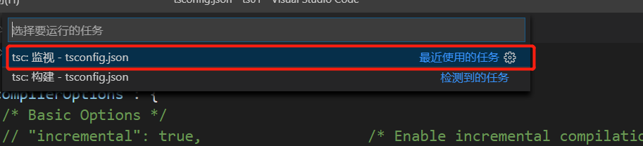

# TypeScript学习笔记

## 一、 TypeScript起步
### 1.1TypeScript简介
1. TypeScript 是由微软开发的一款开源的编程语言。
2. TypeScript 是 Javascript 的超级，遵循最新的 ES6、Es5 规范。TypeScript 扩展了 JavaScript 的语法。
3. TypeScript 更像后端 java、C#这样的面向对象语言可以让 js 开发大型企业项目。 
4. 谷歌也在大力支持 Typescript 的推广，谷歌的 angular2.x+就是基于 Typescript 语法。 
5. 前端三大框架： Angular、Vue 、React 都可以集成 TypeScript。


### 1.2  TypeScript环境搭建

全局安装ts

```
npm install -g typescript
```
编译ts文件为js文件

```
tsc helloworld.ts
```

### 1.3 TypeScript基于vscode自动编译.ts文件
**1.生成tsconfig.json文件**

在项目根目录下运行下面命令：

```
tsc --init  //运行命令后自动生成配置文件
```


**2.在vscode上方的菜单栏中点击【任务】->【运行任务...】**


**3.点击【tsc:监视 - tsconfig.json】**



## 二、TypeScript的数据类型

typescript中为了使编写的代码更规范，更有利于维护，增加了类型校验，在typescript中主要给我们提供了以下数据类型

        布尔类型（boolean）
        数字类型（number）
        字符串类型(string)
        数组类型（array）
        元组类型（tuple）
        枚举类型（enum）
        任意类型（any）
        null 和 undefined
        void类型
        never类型

### 2.1 布尔类型（boolean）
~~~js
var flag:boolean=true; // ts规范需要指定变量的类型
// flag=123;  //错误
~~~

### 2.2 数字类型（number）
~~~js
var num:number = 123;
num = 456;    // 正确
num = 'str';    // 错误
~~~
### 2.3 字符串类型 (string)
~~~js
var str:string='this is ts';
str='haha';  // 正确
str=true;  // 错误
~~~
### 2.4 数组类型（array）
ts中定义数组有两种方式:

第一种：

```js
var arr:number[]=[11,22,33,44];
```
第二种：

```js
var arr:Array<number>=[11,22,33,55];
```

这两种方式均充分体现ts需要指定数据的类型，数组也不例外
### 2.5 元组类型（tuple）--属于数组的一种
元组类型允许表示一个已知元素数量和类型的数组，各元素的类型不必相同。
例如定义一个具有两个值，且两个值分别为字符串和数字的数组:
```js
let arr:[number,string] = [123,'this is ts'];
```
### 2.6 枚举类型（enum)
语法：

~~~

enum 枚举名{ 
                标识符[=整型常数], 
                标识符[=整型常数], 
                ... 
                标识符[=整型常数], 
            } ;    
            
~~~
用法：

~~~js
enum Flag {success=1,error=2};
let s:Flag=Flag.success;
let f:Flag=Flag.success;
~~~

~~~js
enum Color {blue,red,'orange'};
var c:Color=Color.red;
console.log(c);   //1  如果标识符没有赋值 它的值就是下标

enum Color {blue,red=3,'orange'};
var c:Color = Color.red;
console.log(c);   //3
var c:Color = Color.orange;
console.log(c);   //4

enum Err {'undefined' = -1,'null' = -2,'success' = 1};
var statusCode:Err = Err.success;
console.log(e);
~~~
### 2.7 任意类型（any）
~~~js
var num:any=123;
num='str';
num=true;
~~~

### 2.8 null 和 undefined

null 和 undefined 为其他（never）类型的子类型

~~~js
var num:number;
console.log(num)  //输出：undefined   报错
~~~

~~~js
var num:undefined;
console.log(num)  //输出：undefined  //不报错
~~~

```js
var b:null;
b = 123 // 错误写法
b = null;
console.log(b)  //输出：null  //正确
```

一个类型有可能是number类型也有可能是undefined类型，那我们就可以使用联合类型给其指定

```js
let num:number | undefined | null
console.log(num);  
num = null
console.log(num);  
num = 123
console.log(num);
```

### 2.9 void类型
void类型 :typescript中的void表示没有任何类型，一般用于定义函数的时候方法没有返回值。
用来表示函数无返回值的情况：

~~~js
function run():void{
            console.log('run')
        }
run();
~~~

函数有返回值的情况，规范做法是写出返回值类型：

~~~js
function fn():number{
           return 123;
        }
 fn();
~~~

### 2.10 never类型(仅做了解)
其他类型 （包括 null 和 undefined）的子类型，代表从不会出现的值。

这意味着声明never的变量只能被never类型所赋值。

~~~js
var a:undefined;
a = undefined;
var b:null;
b = null;

let a:never   
a = (()=>{
    
    throw new Error("错了")  
})()         // 抛出错误属于其他类型
console.log(a);        
~~~

## 三、typeScript中的函数
### 3.1 函数的定义
第一种：函数声明法

~~~js
function run():string{
	return 'run';
}
~~~

第二种：匿名函数

~~~js
var fun2 = function():number{
	return 123;
}
~~~

带參函数：

带參函数的函数声明法

~~~js
function getInfo(name:string,age:number):string{
	return `${name} --- ${age}`;
}
~~~

带參函数的匿名函数法

~~~js
var getInfo=function(name:string,age:number):string{
	return `${name} --- ${age}`;
}
~~~

无返回值的方法：

~~~js
function run():void{
 console.log('run')
 }
run();
~~~

### 3.2 可选参数 

~~~js
function getInfo(name:string,age?:number):string{
	if(age){
			return `${name} --- ${age}`;
		}else{
        	return `${name} ---年龄保密`;
        }
}
~~~

**注意:可选参数必须配置到参数的最后面**

### 3.3 默认参数

es5里面没法设置默认参数，es6和ts中都可以设置默认参数

```js
function getInfo(name:string,age:number=20):string{
    if(age){
        return `${name} --- ${age}`;
    }else{
        return `${name} ---年龄保密`;
    }
 }
```


### 3.4 剩余参数

```js
function sum(a:number,b:number,c:number,d:number):number{
 	return a+b+c+d;
}
sum(1,2,3,4);
```

```js
// 三点运算符：接受实參传过来的值
function sum(...res:number[]):number{ 
      var sum=0;
      // 在函数中可以直接使用这个数组
      for(let i=0;i<result.length;i++){
      	sum+=res[i];  
      }
      return sum;
}
sum(1,2,3,4,5,6);
```

```js
function sum(a:number,b:number,...result:number[]):number{   
        var sum=a+b;
        for(var i=0;i<result.length;i++){
            sum+=result[i];  
        }
        return sum;
 }
 sum(1,2,3,4,5,6);
```

### 3.5 ts函数重载

typescript中的重载：通过为同一个函数提供多个函数类型定义来达到多种功能的目的。

```js
/* 参数个数一样 */

// function getInfo(name:string):string;
// function getInfo(age:number):string;
// function getInfo(str:any):any{
//     if(typeof str==='string'){
//         return '我叫：'+str;
//     }else{
//         return '我的年龄是'+str;
//     }
// }
// alert(getInfo('张三'));   //正确
// alert(getInfo(20));   //正确
// alert(getInfo(true));    //错误写法

/* 参数个数不一致 */

function getInfo(name:string):string;
function getInfo(name:string,age:number):string;
function getInfo(name:any,age?:any):any{
    if(age){
        return '我叫：'+name+'我的年龄是'+age;
    }else{
        return '我叫：'+name;
    }
}
// alert(getInfo('zhangsan'));  /*正确*/
// alert(getInfo(123));  错误
// alert(getInfo('zhangsan',20));
```

### 3.6 箭头函数

和es6语法用法一样

```js
setTimeout(()=>{
    alert('run');
},1000);
```
### es5中的类(复习)
1 基础类

```js
function Person(){
     this.name = '张三';
     this.age = 20;
 }
var p = new Person();
alert(p.name);
```
2 构造函数和原型链里面增加方法

```js
function Person(){
     this.name = '张三';  /*属性*/
     this.age = 20;
     this.run = function(){
           alert(this.name+'在运动');
      }
}
//原型链上面的属性会被多个实例共享   构造函数不会
Person.prototype.sex = "男";
Person.prototype.work = function(){
     alert(this.name+'在工作');
}

var p = new Person();
// alert(p.name);
// p.run();
p.work();
```

3 类里面的静态方法

```js
function Person(){
      this.name='张三';  /*属性*/
      this.age=20;
      this.run=function(){  /*实例方法*/
       	alert(this.name+'在运动');
     }  
}
        
Person.getInfo=function(){
      alert('我是静态方法');
}
 //原型链上面的属性会被多个实例共享   构造函数不会
Person.prototype.sex="男";
Person.prototype.work=function(){
     alert(this.name+'在工作');
}

var p=new Person();    
p.work();

//调用静态方法
Person.getInfo();
```
4 es5里面的继承--对象冒充实现继承

```js
function Person() {
    this.name = '张三'; /*属性*/
    this.age = 20;
    this.run = function () {
        /*实例方法*/
        alert(this.name + '在运动');
    
}
Person.prototype.sex = "男";
Person.prototype.work = function () {
    alert(this.name + '在工作');

}

//Web类 继承Person类   原型链+对象冒充的组合继承模式

function Web() {
    Person.call(this); /*对象冒充实现继承*/
}

var w = new Web();
// w.run();  //对象冒充可以继承构造函数里面的属性和方法

w.work(); //对象冒充可以继承构造函数里面的属性和方法   但是没法继承原型链上面的属性和方法
```
5 es5里面的继承--原型链实现继承

```js
function Person(){
    this.name='张三';  /*属性*/
    this.age=20;
    this.run=function(){  /*实例方法*/
        alert(this.name+'在运动');
    }
}      
Person.prototype.sex="男";
Person.prototype.work=function(){
        alert(this.name+'在工作');
}


function Web(){

}

Web.prototype=new Person();   //原型链实现继承
var w=new Web();
//原型链实现继承:可以继承构造函数里面的属性和方法 也可以继承原型链上面的属性和方法
//w.run();
w.work();
```
6 原型链实现继承的问题

```js
function Person(name,age){
    this.name=name;  /*属性*/
    this.age=age;
    this.run=function(){  /*实例方法*/
        alert(this.name+'在运动');
    
}      
Person.prototype.sex="男";
Person.prototype.work=function(){
	alert(this.name+'在工作');
}  
var p=new Person('李四',20);
p.run();

function Person(name,age){
    this.name=name;  /*属性*/
    this.age=age;
    this.run=function(){  /*实例方法*/
        alert(this.name+'在运动');
    }
}      
Person.prototype.sex="男";
Person.prototype.work=function(){
    alert(this.name+'在工作');
}

function Web(name,age){ }
Web.prototype=new Person();
var w=new Web('赵四',20);   //实例化子类的时候没法给父类传参
w.run();

// var w1=new Web('王五',22);
```
7 原型链+对象冒充的组合继承模式

```js
function Person(name,age){
    this.name=name;  /*属性*/
    this.age=age;
    this.run=function(){  /*实例方法*/
        alert(this.name+'在运动');
    }
}

Person.prototype.sex="男";
Person.prototype.work=function(){
    alert(this.name+'在工作');
}

function Web(name,age){
    Person.call(this,name,age);   //对象冒充继承   实例化子类可以给父类传参
}

Web.prototype=new Person();

var w=new Web('赵四',20);   //实例化子类的时候没法给父类传参

// w.run();
w.work();

// var w1=new Web('王五',22);
```

8 原型链+对象冒充继承的另一种方式

```js
function Person(name, age) {
    this.name = name; /*属性*/
    this.age = age;
    this.run = function () {
        /*实例方法*/
        alert(this.name + '在运动');
    }

}
Person.prototype.sex = "男";
Person.prototype.work = function () {
    alert(this.name + '在工作');
}

function Web(name, age) {
	Person.call(this, name, age); //对象冒充继承  可以继承构造函数里面的属性和方法、实例化子类可以给父类传参
}	

Web.prototype = Person.prototype;
var w = new Web('赵四', 20); 

w.run();
// w.work();

// var w1=new Web('王五',22);
```
## 四、typeScript中的类

### 4.1 ts中类的定义
基本语法：

```
class 类名 {

	属性名:属性类型;
	
	constructor(){}
	
	// 也可以包含方法
	fn(){}
	
}
```
实体化类：

```js
var obj = new Student(); 
```


```js
class Person{

    name:string;   //属性  前面省略了public关键词

    constructor(n:string){  //构造函数   实例化类的时候触发的方法
        this.name=n;
    }

    run():void{

        alert(this.name);
    }

}
var p = new Person('张三');

p.run()
```

```js
class Person{
    name:string; 
    
    constructor(name:string){  //构造函数   实例化类的时候触发的方法
        this.name=name;
    }
    
    getName():string{
        return this.name;
    }
    
    setName(name:string):void{
        this.name=name;
    }
}

var p=new Person('张三');
alert(p.getName());

p.setName('李四');
alert(p.getName());
```

### 4.2 ts中实现继承  

ts中继承类会使用到extends和super关键字，被继承的类一般叫叫基类、父类、超类；继承的类一般被称作派生类、子类


```js
class Person{
    name:string;
    
    constructor(name:string){
        this.name=name;
    }
    
    run():string{
        return `${this.name}在运动`
    }
}

// var p = new Person('王五');
// alert(p.run());

class Web extends Person{
    constructor(name:string){
        super(name);  /*初始化父类的构造函数*/
    }
}

var w=new Web('李四');
alert(w.run());
```
ts中父类的方法和子类的方法一致时，初始化谁就执行谁的方法

```js
class Person{

    name:string;

    constructor(name:string){
        this.name=name;
    }

    run():string{

        return `${this.name}在运动`
    }
}
// var p=new Person('王五');
// alert(p.run())


class Web extends Person{
    constructor(name:string){
		// 如果继承的父类有构造函数，此时派生类必须调用 super()，它会执行父类的构造函数。 而且，在构造函数里访问this的属性之前，我们一定要调用super()。这个是TypeScript强制执行的一条重要规则。
        super(name);  /*初始化父类的构造函数*/
        
    }
    run():string{
        return `${this.name}在运动-子类`
    }
    work(){
        alert(`${this.name}在工作`)
    }
}

// var w=new Web('李四');
// alert(w.run());
// w.work();

```

### 4.3 类里面的修饰符
typescript里面定义属性的时候给我们提供了 三种修饰符

1. public :公有          在当前类里面、 子类  、类外面都可以访问

1. protected：保护类型    在当前类里面、子类里面可以访问 ，在类外部没法访问

1. private ：私有         在当前类里面可以访问，子类、类外部都没法访问

注意： 属性如果不加修饰符 默认就是 公有 （public）

#### 4.3.1 public :公有 -- 在类里面、 子类  、类外面都可以访问

```js
class Person{

    public name:string;  /*公有属性*/

    constructor(name:string){
        this.name=name;
    }

    run():string{

        return `${this.name}在运动`
    }
}
// var p=new Person('王五');
// alert(p.run())


class Web extends Person{
    constructor(name:string){

        super(name);  /*初始化父类的构造函数*/
    }
    run():string{

        return `${this.name}在运动-子类`
    }
    work(){

        alert(`${this.name}在工作`)
    }
}

var w=new Web('李四');

w.work();

```

类外部访问公有属性:

```js
class Person{

    public name:string;  /*公有属性*/

    constructor(name:string){
        this.name=name;
    }

    run():string{

        return `${this.name}在运动`
    }
}

var  p=new Person('哈哈哈');

alert(p.name);
```
#### 4.3.2 protected：保护类型--在类里面、子类里面可以访问 ，在类外部没法访问

```js
class Person{

        protected name:string;  /*公有属性*/

        constructor(name:string){
            this.name=name;
        }

        run():string{

            return `${this.name}在运动`
        }
    }
    var p=new Person('王五');
    alert(p.run());
    
    class Web extends Person{
    constructor(name:string){

        super(name);  /*初始化父类的构造函数*/
    }                  
    work(){

        alert(`${this.name}在工作`)
    }
}

var w=new Web('李四11');
w.work();
alert( w.run())
```
#### 4.3.3 private ：私有 --在类里面可以访问，子类、类外部都没法访问

```js
class Person{

        private name:string;  /*私有*/

        constructor(name:string){
            this.name=name;
        }

        run():string{

            return `${this.name}在运动`
        }
    }

    var p = new Person('哈哈哈').name // 报错，只能在Person类中访问;

```
### 4.4 静态属性 静态方法

静态属性与静态方法定义存在于**类本身上面**而不是类的实例上的属性和方法，不能直接被实例化对象直接访问，只能被类本身调用，使用 static定义：

```js

class Per{
    public name:string;
    public age:number=20;
    
    //静态属性
    static sex="男";
    
    constructor(name:string) {
            this.name=name;
    }
    run(){  /*实例方法*/
        alert(`${this.name}在运动`)
    }
    work(){
        alert(`${this.name}在工作`)
    }
    
    static print(){  /*静态方法  不能直接调用类中的数据，但可以通过访问静态属性的方式来获取数据*/
    	// alert('print方法'+this.name); /* 错误，访问不到 */
        alert('print方法'+Per.sex); /* 正确，可以访问静态方法*/
    }
}

// var p=new Per('张三');
// p.run();

Per.print();
alert(Per.sex);
```
### 4.5 多态
父类定义一个方法不去实现，让继承它的子类去实现  每一个子类有不同的表现

```js
/*父类 Animal*/
class Animal {
    name:string;
    constructor(name:string) {
        this.name=name;
    }
    eat(){   //具体吃什么不知道，  具体吃什么?继承它的子类去实现 ，每一个子类的表现不一样
        console.log('吃的方法')
    }
}

/*子类 Dog*/
class Dog extends Animal{
    constructor(name:string){
        super(name);
    }
    eat(){
        return this.name+'吃肉骨头';
    }
}

／*子类 Cat*／
class Cat extends Animal{
    constructor(name:string){
        super(name)
    }
    eat(){
        return this.name+'吃鱼'
    }
}
```

### 4.6 抽象类
typescript中的抽象类特点：

* 它是提供其他类继承的基类，不能直接被实例化。
* 用abstract关键字定义抽象类和抽象方法，抽象类中的抽象方法不包含具体实现并且必须在派生类中实现。
* abstract抽象方法只能放在抽象类里面
* 抽象类和抽象方法用来定义标准 

标准：

```js
abstract class Animal{
    public name:string;
    constructor(name:string){
        this.name=name;
    }
    abstract eat():any;  //抽象方法不包含具体实现并且必须在派生类中实现。
    run(){
        console.log('其他方法可以不实现')
    }
}

// var a=new Animal() /*错误的写法--抽象类不能直接被实例化*/
```
抽象方法必须在派生类中实现:

```js

／*Dog 子类*／
class Dog extends Animal{
    //抽象类的子类必须实现抽象类里面的抽象方法
    constructor(name:any){
        super(name)
    }
    eat(){
        console.log(this.name+'吃粮食')
    }
}
var d=new Dog('小花花');
d.eat();

／*Cat 子类*／
class Cat extends Animal{
    //抽象类的子类必须实现抽象类里面的抽象方法
    constructor(name:any){
        super(name)
    }
    run(){
    }
    eat(){
        console.log(this.name+'吃老鼠')
    }
}
var c=new Cat('小花猫');
c.eat();
```


